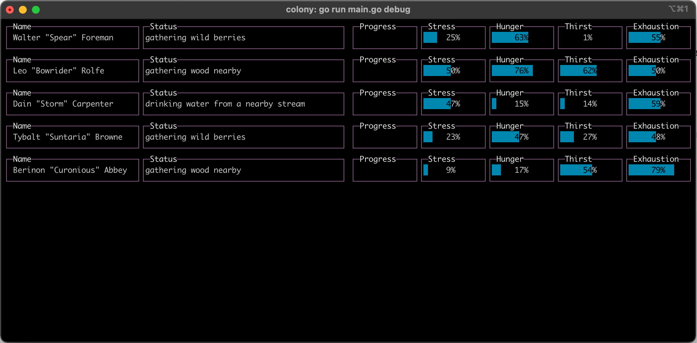

# Go Colony

A colony simulation / game written in Go. The game is currently experimental and a work in progress. I use this project to tinker with various golang concepts.

## How to take it for a spin

To start the game but without a server and render the gamestate to the console, run the following command in a tall terminal window:

```script
go run main.go debug
```



## Quick Backstory

Your colonist has woken up from cryosleep alone on a new planet. Your mission was to be one of the first to colonize the planet. Unfortunately things haven't gone as planned. Your colonist wakes up alone, and it appears others have already looted your supplies and technology.

You will have to slowly build your colony from the ground up despite this setback. Hunt for food, create a settlement, recruit new colonists, and discover advanced technology hidden away. But be careful. Not everyone is friendly, and there appears to be some strange, dangerous creatures roaming about. Maybe something much worse.

## WIP ideas for the game

- gRPC API for streaming game and sending in commands
- Utility-based decision trees. Colonists have a mind of their own, but you can command them to attempt certain tasks. Assign colonists to leadership roles to improve coordinated effort.
- Crafting and Construction. Build farms, mines, workshops, fortificatons, trade depots and other buildings to sustain your colonists needs and desires
- Combat. Train your colonists and prepare them for battle from raiders, dangerous animals and much, much worse things crawling in the dark recesses of the planet
- Trade. Build a trade depot and send your colonists out to trade with other players.

## How to start the game server

To start the game server, run the following command. It will create a default game and you can find the GameKey in the logs.

```script
go run main.go start
```

## How to stream the game server

(There is currently a bug and this is WIP)

Run the following in a tall terminal window to see the JSON game state streamed at 30fps.

```script
go run main.go streamGame {GameKey}
```

## How to pause / speed up the game

```script
go run main.go setSpeed {GameKey} [0|1|2|3]
```

# Contributing

Guide coming soon.

## How To Add Actions

To create a new action, create a new file in the `game/actions/types` directory and then append it to the InitTypes() method at the top of `game/actions/types/types.go`. The following is an example action for gathering wood.

```go
package types

import (
	"encoding/json"

	"github.com/thebrubaker/colony/resources"
)

type GatherWood struct {
}

// MarshalJSON will marshal needs into it's attributes
func (a *GatherWood) MarshalJSON() ([]byte, error) {
	return json.Marshal(map[string]interface{}{
		"status":      a.Status(),
		"energy_cost": a.EnergyCost(),
		"duration":    a.Duration(),
		"priority":    a.Priority(),
	})
}

// UnmarshalJSON fills in the attributes of needs
func (a *GatherWood) UnmarshalJSON(b []byte) error {
	if err := json.Unmarshal(b, a); err != nil {
		return err
	}

	return nil
}

func (a *GatherWood) Status() string {
	return "gathering wood from a nearby forest"
}

func (a *GatherWood) EnergyCost() EnergyCost {
	return Hard
}

func (a *GatherWood) Duration() TickDuration {
	return Slow
}

func (a *GatherWood) Priority() Priority {
	return Job
}

func (a *GatherWood) Gather() (StorageType, interface{}, float64) {
	return ColonistBag, resources.Wood, 0.5
}
```

Open `game/actions/types/types.go` to view the different constants available to you.
